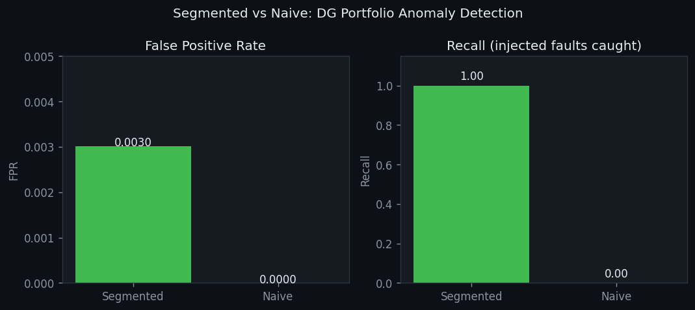

# Distributed Generation Portfolio Monitor

Fault detection for mixed-scale distributed generation fleets. Segmented monitoring catches all faults that naive uniform thresholds miss entirely.

## The Problem

A 5 kW rooftop panel and a 500 kW commercial array have completely different production profiles. A single anomaly threshold that works for the large asset is blind to faults on the small one. Naive monitoring on a mixed-scale fleet detects **0 out of 3** artificially induced faults.

## How It Works

Assets are segmented by capacity class before computing anomaly thresholds. Each segment gets its own baseline derived from its own distribution. The benchmark injects 3 known faults across the fleet and compares segmented vs naive detection:

| Method | Faults detected | False positive rate |
|--------|----------------|-------------------|
| **Segmented** | **3/3** | **0.003** |
| Naive | 0/3 | 0.000 (blind -- detects nothing) |

Naive is not slightly worse. It is completely blind to small-asset faults.

## Invariants

| Test | What it proves |
|------|---------------|
| `test_segmented_catches_all_injected_anomalies` | Recall = 1.0 for all injected faults regardless of asset scale |
| `test_naive_misses_small_asset_faults` | Uniform thresholds fail on mixed-scale portfolios |
| `test_fpr_below_threshold` | Segmented FPR stays below 0.01 |

12 tests passing.

## Benchmark

20 assets (5 small / 15 large) | 365 days | 3 injected faults



## Run It

```bash
python -m venv .venv && source .venv/bin/activate
pip install -r requirements.txt

pytest tests/              # 12 tests
python benchmark.py        # reports/results.json + reports/fpr_comparison.png
```

## Stack

Python, pandas, NumPy, matplotlib
